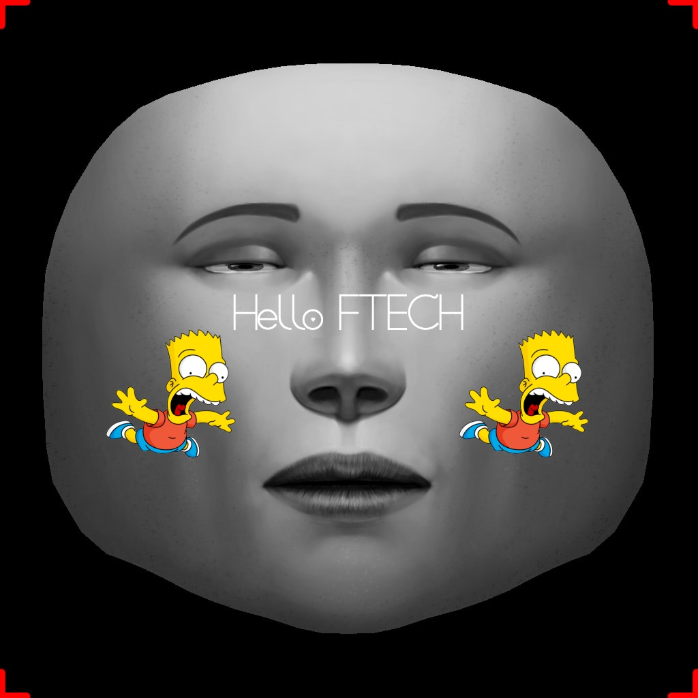

# AR-filter-cpm

```
git clone https://github.com/KudoKhang/AR-filter-cpm
cd AR-filter-cpm
pip install gdown
gdown --id 1UoE-XuW1SDLUjZmJPkIZ1MLxvQFgmTFH -O PRNet/net-data
python main.py --input "tests/input.jpg" --style "tests/fillter256.png"
```
IN THRER:

--input: A straight face have size 256 * 256
<p align="center">
    
</p>

--style: A square mask

<p align="center">
    
</p>
Result:
<p align="center">
    
</p>

Note: Create mask based-on face UV_texture (using https://pixlr.com or photoshop)

<p align="center">
    
</p>

# Todo-list:
- [ ] Face detection

- [ ] Transfrom rectangle bbox -> square bbox (256 * 256)