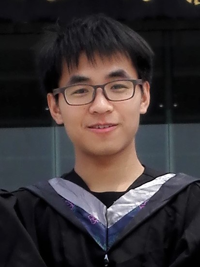
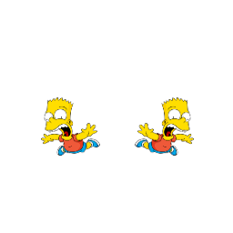
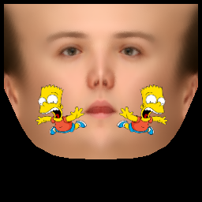

# AR Filter based-on PRNet

How to use:
```
git clone https://github.com/KudoKhang/AR-filter-cpm
cd AR-filter-cpm
sh ./build.sh
python main.py --input "tests/JianzhuGuo.jpg" --style "tests/uv_face_sticker.png"
```
IN THRER:

--input: A person image
 
<p align="center">
    
</p>

--style: A square mask

<p align="center">
    
</p>
Result:
<p align="center">
    
</p>

Guide: Create mask based-on face UV_texture of PRNet (using https://pixlr.com or photoshop)

<p align="center">
    
</p>

# Todo-list:
- [x] Face detection

- [x] Transfrom rectangle bbox -> square bbox (256 * 256)

- [x] Restore image

- [ ] Set opacity